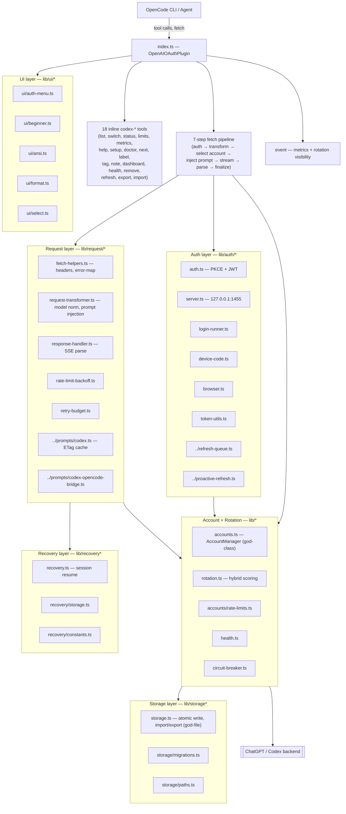
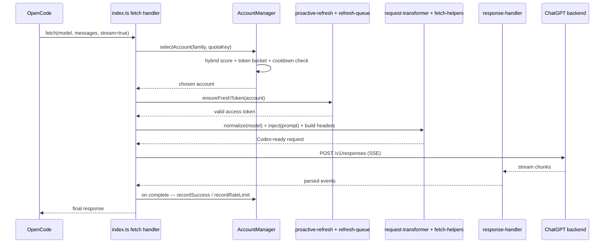
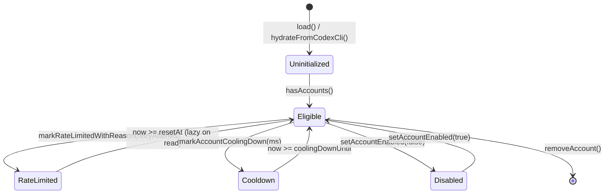

> **Audit SHA**: d92a8eedad906fcda94cd45f9b75a6244fd9ef51 | **Generated**: 2026-04-17T09:28:39Z | **Task**: T18 Synthesis | **Source**: docs/audits/_meta/findings-ledger.csv

# 02 — System Map

**Scope**: architecture overview drawn from T01 findings + `docs/development/ARCHITECTURE.md`. This chapter is deliberately *overview-first*; per-module detail lives in [§15-file-by-file.md](15-file-by-file.md). Mermaid diagrams below render directly on GitHub.

---

## Major layers



---

## Request flow (7-step pipeline)



---

## State flow (account lifecycle)



**Weaknesses surfaced by T03**:
- `currentAccountIndexByFamily` has an asymmetric reset (§03 CRITICAL referenced in [§04-high-priority.md](04-high-priority.md) entry for `lib/accounts.ts:851-862`).
- `getActiveIndexForFamily` silently coerces `-1 → 0` without writing back ([§05-medium.md](05-medium.md)).
- Cooldown clear is lazy-on-read; a concurrent writer can race the clearer ([§05-medium.md](05-medium.md) `57`).

---

## Trust boundaries

```mermaid
graph LR
    subgraph TrustedInternal["Trusted (in-process)"]
      AccountsMem[AccountManager state]
      RefreshQueueMem[refresh-queue Map]
      LoggerMem[logger buffers]
    end

    subgraph TrustedLocal["Trusted-local (file-system)"]
      AccountsJson[accounts JSON — 0o600]
      FlaggedJson[flagged accounts JSON]
      BackupJson[*.timestamped.json]
      RecoveryJson[session-recovery parts]
      LogsDir[~/.opencode/logs]
      GitIgnore[.gitignore]
      OpenCodeJson[~/.config/opencode/opencode.json]
    end

    subgraph Untrusted["UNTRUSTED inputs"]
      OAuthRedirect[/auth/callback req.url]
      OAuthState[?state query param]
      OAuthCode[?code query param]
      ImportedJson[imported accounts JSON]
      UserConfig[opencode.json plugin config]
      CodexCliBridge[Codex CLI cross-process JSON]
      ChatGPTResp[Codex API response body]
      GitHubETag[GitHub prompt-template response]
      Env[env vars: CODEX_AUTH_ACCOUNT_ID, CODEX_MODE, …]
    end

    OAuthRedirect -->|validate state, timing-safe| AccountsMem
    OAuthCode -->|exchange for token| AccountsMem
    ImportedJson -->|normalizeAccountStorage — unvalidated| AccountsJson
    UserConfig -->|Partial spread — unvalidated| AccountsMem
    CodexCliBridge -->|unsigned JSON — unvalidated| AccountsMem
    ChatGPTResp --> LogsDir
    Env -->|verbatim trust| AccountsMem
    AccountsMem --> AccountsJson
    AccountsMem --> BackupJson
    AccountsJson -. pre-import backup .-> BackupJson
```

**Key boundaries violated by findings**:
- **Untrusted → Trusted (imported JSON)** has no Zod validation (HIGH `81`).
- **Untrusted → Trusted (plugin config)** has no Zod validation (HIGH `83`).
- **Untrusted → Trusted (Codex CLI bridge)** has no validation (HIGH `15`).
- **Untrusted → Trusted (JWT)** uses the decoded payload without verifying signature (HIGH `82`).
- **Untrusted → Trusted (env `CODEX_AUTH_ACCOUNT_ID`)** is trusted verbatim (MEDIUM `27`).

Fix target: RC-9 (process-boundary validation — see [§07-refactoring-plan.md](07-refactoring-plan.md)).

---

## Risk boundaries

| Boundary | Class of concern | Ledger anchor | Primary chapter |
|---|---|---|---|
| Local file → plaintext token | credential at rest | HIGH `13` | §09 |
| 500 ms debounce window | crash-loss of rotation | HIGH `14`, `95`, `120` | §09, §07 RC-10 |
| `authFailuresByRefreshToken` race | stuck-login loop | CRITICAL `47` | §03 |
| OAuth `_lastCode` single slot | concurrent-login collision | HIGH `123` pre-verification | §10 |
| Installer `provider.openai` overwrite | user-config loss | HIGH `202` | §09, §11 |
| V4+ `schemaVersion` silent discard | downgrade data loss | HIGH `200` | §09, §07 RC-2 |
| V2 missing migrator | upgrade data loss | HIGH `201` | §07 RC-2 |
| SSE "no final response" | session break mis-logged | HIGH `153` | §09 |
| Typed errors unused | user-msg / retry drift | HIGH `173` | §07 RC-3 |
| `@openauthjs/openauth` license | supply-chain / legal | HIGH `274` | §09 |

---

## External references

- `docs/development/ARCHITECTURE.md` — canonical architecture doc (v4.4.0/v4.5.0 vocabulary; pre-dates v6.0.0 rebrand per LOW `12`).
- `docs/development/CONFIG_FLOW.md` — config flow.
- `lib/AGENTS.md` — internal module catalog.

This system map is **descriptive**, not **prescriptive** — it captures what the code does today, not what it should do. For the "should" see §07 refactoring plan and §13 phased roadmap.
